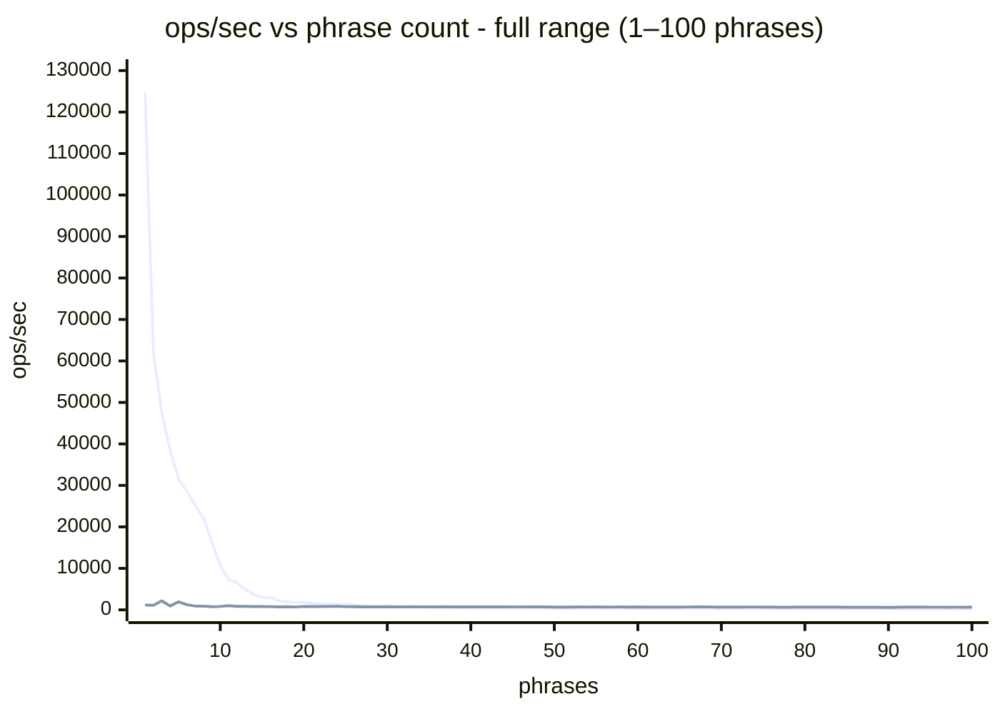
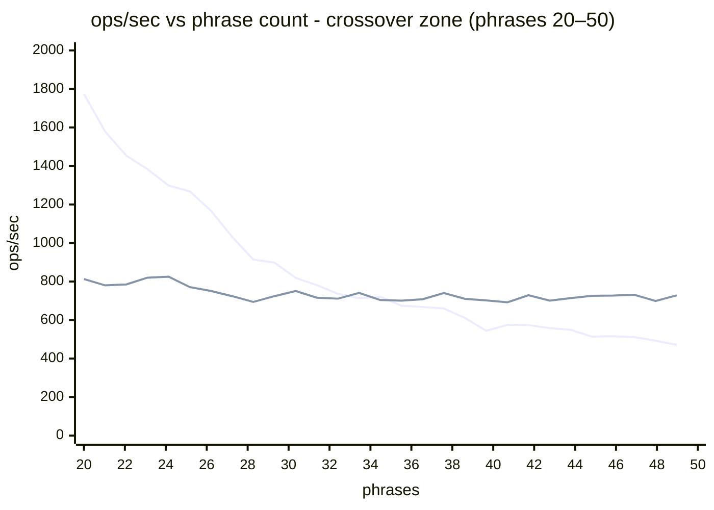

# Benchmark Analysis

Four approaches compared across all test cases:

| Approach | What it does |
|----------|-------------|
| **simple (find all)** | Loops `indexOf` per phrase until exhausted; returns every occurrence with position |
| **simple (find first)** | Loops `indexOf` per phrase; returns the first phrase found anywhere, then stops |
| **custom `exec()`** | Aho-Corasick single pass; returns every occurrence with position |
| **custom `execFirst()`** | Aho-Corasick single pass; returns the first match encountered, then stops |

`simple (find all)` and `custom exec()` do the same job. `simple (find first)` and `custom execFirst()` do the same job.

**Semantic difference in find-first:** `simple (find first)` returns the first **phrase by list order** that appears anywhere in the text. `custom execFirst()` returns the first **match by text position** (left-to-right scan). Results differ when the phrase appearing earliest in the text is not the first phrase in the list.

All figures are ops/sec. Higher is better.

---

## Foods - ~130 phrases, 4–14 chars each

A large dictionary of food names. Short phrases are where native `indexOf` is hardest to beat, but there are enough of them (130) that the multi-phrase cost starts to show.

### short foods 1

**What this tests:** a tiny 48-char text with 1 match. Shows the overhead of 130 `indexOf` calls vs a single trie pass on the shortest possible search.

| | simple (find all) | simple (find first) | custom exec() | custom execFirst() |
|-|------------------:|--------------------:|--------------:|-------------------:|
| ops/sec | 944K | 13,713K | 4,397K | 13,411K |
| vs simple (find all) | - | 14.5× faster | 4.7× faster | 14.2× faster |

Both find-first variants are ~14× faster than find-all - on a 48-char text, stopping at the first match saves nearly the entire scan. `custom exec()` is 4.7× faster than `simple (find all)` because it makes one trie pass instead of 130 `indexOf` calls, even on this short text.

### short foods 2

**What this tests:** a 490-char paragraph with 4 matches. The text is long enough that `custom execFirst()` starts to separate from `simple (find first)`.

| | simple (find all) | simple (find first) | custom exec() | custom execFirst() |
|-|------------------:|--------------------:|--------------:|-------------------:|
| ops/sec | 363K | 2,707K | 382K | 4,173K |
| vs simple (find all) | - | 7.5× faster | ~same | 11.5× faster |

`custom execFirst()` (4.2M) now beats `simple (find first)` (2.7M) - with 130 phrases, simple must iterate through multiple `indexOf` calls before hitting the first match, whereas custom stops the moment any match is encountered in the text.

### medium foods 1

**What this tests:** a 1,000-char text with 5 matches including an overlapping prefix pair ("Grape"/"Grapefruit"). Shows `custom execFirst()` pulling well clear as text length grows.

| | simple (find all) | simple (find first) | custom exec() | custom execFirst() |
|-|------------------:|--------------------:|--------------:|-------------------:|
| ops/sec | 180K | 1,409K | 139K | 8,662K |
| vs simple (find all) | - | 7.8× faster | 23% slower | **48× faster** |

`custom execFirst()` reaches 8.7M - the fastest figure in the entire foods suite. Once a match is found the scan stops; with 130 phrases in a trie a match is hit early and the remaining text is skipped entirely. `custom exec()` dips slightly below `simple (find all)` here - the per-character trie overhead costs more than the saving on a 1K text with only 130 phrases.

---

## Movies - 249 phrases, 5–37 chars each

Movie titles - longer than food names, more phrases, multi-word patterns with spaces. The increased phrase count and length both favour Aho-Corasick.

### medium movies 1

**What this tests:** a 3,800-char text with 8 matches. With 249 phrases averaging ~18 chars, simple must make many long `indexOf` calls before finding a match.

| | simple (find all) | simple (find first) | custom exec() | custom execFirst() |
|-|------------------:|--------------------:|--------------:|-------------------:|
| ops/sec | 37.8K | 566K | 45.3K | 6,375K |
| vs simple (find all) | - | 15× faster | 20% faster | **169× faster** |

The largest single gap in the entire benchmark. `custom execFirst()` (6.4M) is 169× faster than `simple (find all)` and 11× faster than `simple (find first)`. With 249 phrases, simple's find-first must try many of them before hitting a match; custom's single trie pass stops immediately. `custom exec()` edges ahead of `simple (find all)` as phrase count passes 249.

---

## Quotes - 5,523 phrases, 40–85 chars each

Full sentences as search phrases. Each `indexOf` call must scan up to 85 characters per position in the text. The phrase count (5,523) makes repeated `indexOf` loops extremely expensive; Aho-Corasick's single-pass advantage is decisive.

### short quotes 1

**What this tests:** a 200-char text with 1 match. Exposes the phrase-ordering effect: `simple (find first)` exits after just 1–2 `indexOf` calls because the matching phrase is near the front of the list.

| | simple (find all) | simple (find first) | custom exec() | custom execFirst() |
|-|------------------:|--------------------:|--------------:|-------------------:|
| ops/sec | 12.0K | 15,870K | 821K | 906K |
| vs simple (find all) | - | 1,322× faster | 68× faster | 75× faster |

`simple (find first)` hits 15.9M - the highest figure in the entire benchmark - because the matching phrase is near the front of the 5,523-phrase list. This is a phrase-ordering best case, not a throughput guarantee. `custom exec()` and `custom execFirst()` are nearly identical (~900K each) because the match falls near the end of the short 200-char text, leaving little to skip.

### medium quotes 1

**What this tests:** a 1,800-char text with 4 matches. Text length grows enough that `custom execFirst()` begins closing the gap on `simple (find first)`.

| | simple (find all) | simple (find first) | custom exec() | custom execFirst() |
|-|------------------:|--------------------:|--------------:|-------------------:|
| ops/sec | 2,213 | 4,004K | 82.1K | 2,085K |
| vs simple (find all) | - | 1,810× faster | 37× faster | 942× faster |

`simple (find first)` still leads (4M vs 2.1M for `custom execFirst()`) but the gap has halved compared to the 200-char test. `custom exec()` is 37× faster than `simple (find all)` - 5,523 long phrases scanned with `indexOf` over 1,800 chars is where the algorithm really starts to hurt simple.

### long quotes 1

**What this tests:** a 12,000-char text with 3 matches. At this length `custom exec()` dominates find-all, and `custom execFirst()` is now within 5× of `simple (find first)` despite the phrase-ordering advantage simple holds.

| | simple (find all) | simple (find first) | custom exec() | custom execFirst() |
|-|------------------:|--------------------:|--------------:|-------------------:|
| ops/sec | 335 | 1,062K | 10,550 | 205K |
| vs simple (find all) | - | 3,170× faster | **31× faster** | 611× faster |

`custom exec()` wins find-all by 31×. `simple (find first)` (1.1M) still beats `custom execFirst()` (205K) by 5× - but only because the matching phrase sits near the front of the list. Shuffle that phrase to position 5,000 and simple's number collapses to near its find-all figure; custom's is unaffected.

---

## Winnie-the-Pooh - phrase count (12–13 real phrases)

Phrases taken from the actual text of Winnie-the-Pooh (~123K chars, ~100 pages). All phrases guaranteed to match at least once. Run `npm run fetch-texts` to download.

### winnie-names

**What this tests:** 12 character and place names (3–17 chars, 934 total matches) against a 123K-char text. Shows that with very few phrases, `indexOf` beats the trie walk even on a long text.

| | simple (find all) | simple (find first) | custom exec() | custom execFirst() |
|-|------------------:|--------------------:|--------------:|-------------------:|
| ops/sec | 5,096 | 24,353K | 1,155 | 1,101K |
| vs simple (find all) | - | 4,779× faster | 4.4× slower | 216× faster |

`simple (find first)` hits 24.4M - the highest figure in the entire benchmark - because "Winnie-the-Pooh" is both first in the list and first in the text; `indexOf` exits after ~20 characters. `custom exec()` loses to `simple (find all)` by 4.4× even at 123K chars: with only 12 phrases, 12 native `indexOf` loops are cheaper than a 123K-character trie walk. `custom execFirst()` is order-independent - if the phrase list were shuffled, simple's number would collapse and custom's would be unchanged.

### winnie-quotes

**What this tests:** 13 actual lines from the book (8–55 chars, ~20 total matches) against a 123K-char text. Similar story to winnie-names; phrase count is still too low for the trie to win on find-all.

| | simple (find all) | simple (find first) | custom exec() | custom execFirst() |
|-|------------------:|--------------------:|--------------:|-------------------:|
| ops/sec | 3,834 | 3,841K | 804 | 127K |
| vs simple (find all) | - | 1,001× faster | 4.8× slower | 33× faster |

`custom exec()` is 4.8× slower than `simple (find all)` - 13 `indexOf` loops on a 123K text still beats a full trie scan at this phrase count. `custom execFirst()` (127K) is 30× slower than `simple (find first)` (3.8M) but, as always, that gap is phrase-order-dependent for simple.

---

## Winnie-the-Pooh - match position (start / middle / end)

**What this tests:** one phrase, appearing exactly once, at three positions in the 123K-char text - character 33 (0%), 58,045 (47%), and 110,983 (90%). Isolates how far into the text a match sits affects early-exit performance. Find-all approaches always scan the full text so their numbers are constant; find-first degrades linearly with match position.

| | simple (find all) | simple (find first) | custom exec() | custom execFirst() |
|-|------------------:|--------------------:|--------------:|-------------------:|
| winnie-start (pos 33, 0%) | 63,099 | **45,232,535** | 1,073 | **3,522,320** |
| winnie-middle (pos 58K, 47%) | 58,719 | 132,328 | 1,069 | 2,436 |
| winnie-end (pos 111K, 90%) | 58,629 | 62,240 | 1,077 | 1,260 |

`simple (find all)` and `custom exec()` are flat across all three positions - both always scan the full 123K chars. `simple (find first)` falls 727× from start to end (45M → 62K); `custom execFirst()` falls 2,794× from start to end (3.5M → 1,260). At the end position, both find-first variants converge with their find-all counterparts - by position 90%, they have already done 90% of the full scan.

The 13× gap between `simple (find first)` and `custom execFirst()` at the start reflects native `indexOf`'s hardware-level string search vs per-character trie overhead. This gap closes as phrase count grows, because then simple must make multiple `indexOf` calls while custom still makes one trie pass.

---

## Winnie-the-Pooh - extreme match density: `" the "` (568 occurrences)

**What this tests:** a single very common 5-char phrase appearing 568 times in 123K chars (first at position 522). Stresses the output-emission path - every match must be recorded, so high density punishes find-all approaches. With only 1 phrase there is no multi-phrase advantage for Aho-Corasick.

| | simple (find all) | simple (find first) | custom exec() | custom execFirst() |
|-|------------------:|--------------------:|--------------:|-------------------:|
| ops/sec | 6,204 | 1,041,005 | 974 | 418,397 |
| vs simple (find all) | - | 168× faster | 6.4× slower | 67× faster |

Find-first is ~168× faster than find-all for simple and ~430× faster for custom - recording 568 results dominates both approaches. `simple (find all)` (6.2K) beats `custom exec()` (974) by 6×: with 1 phrase there is no benefit to the trie, just overhead. `simple (find first)` (1.04M) beats `custom execFirst()` (418K) by 2.5×: both scan to position 522 and stop, but native `indexOf` has faster raw throughput than the trie walk at this scale.

---

## Phrase-count scaling - the crossover point

**What this tests:** one phrase added at a time, from 1 to 100, against the full 123K-char Winnie-the-Pooh text. Shows where Aho-Corasick's single-pass advantage overtakes repeated `indexOf` calls.

`simple (find all)` must make N `indexOf` calls - one per phrase - each scanning up to 123K chars. Its cost grows linearly with phrase count. `custom exec()` always makes one trie pass regardless of N, so its cost is flat.

Run with `npm run benchmark:phrase-count`.

**Full picture - phrases 1–100** (simple starts at 124K ops/s, making the crossover region near-invisible at this scale):

_Line 1 (falling): `simple`. Line 2 (flat): `custom`._

**Crossover - phrases 20–50** (zoomed in; both lines now visible; crossover at phrase 33):

_Line 1 (falling): `simple`. Line 2 (flat): `custom`. Lines cross between phrases 32 and 33._

The crossover happens at **phrase 33** - the first point where custom edges ahead (741 vs 713 ops/s). After that custom holds the lead and the gap widens steadily to **3.3× at 100 phrases**.

| phrases | simple (ops/s) | custom (ops/s) | winner |
|--------:|---------------:|---------------:|--------|
| 1 | 124,863 | 1,163 | simple 107× |
| 10 | 10,669 | 814 | simple 13× |
| 20 | 1,774 | 813 | simple 2.2× |
| 30 | 819 | 751 | simple 1.1× |
| **33** | **713** | **741** | **custom (crossover)** |
| 40 | 575 | 692 | custom 1.2× |
| 60 | 353 | 715 | custom 2× |
| 100 | 198 | 650 | custom 3.3× |

Simple's steep drop reflects each additional phrase adding a full 123K-char `indexOf` scan. Custom's flat line reflects a fixed-cost trie walk - extra phrases widen the trie slightly but don't change how many characters are scanned.

---

## Case-insensitive overhead

`Search` accepts `{ caseInsensitive: true }` at construction. The option stores `s => s.toLowerCase()` as a normalise function, applying it to each phrase at insert time and to the full text at the start of every `exec()` call. The trie is built on lowercased phrases and searches a lowercased copy of each input text. The original phrase casing is preserved in results.

The per-exec cost is dominated by the `text.toLowerCase()` call - a new string allocation proportional to text length - on every search.

### Build overhead

**What this tests:** one-time cost of building the trie with normalisation applied to each phrase.

**winnie-quotes (13 phrases):**

| | case-sensitive | case-insensitive | overhead |
|-|-:|-:|-:|
| ops/sec | 82,267 | 74,985 | - |
| µs per build | 12.2 | 13.3 | +9% |

Build overhead is small - `toLowerCase()` is called once per phrase character at insert time, which is a tiny fraction of the BFS trie construction.

### Exec overhead

**What this tests:** repeated per-call cost of normalising the full text before every search.

**winnie-quotes (13 phrases), 123K-char text:**

| | case-sensitive | case-insensitive | overhead |
|-|-:|-:|-:|
| ops/sec | 886 | 731 | - |
| µs per exec | 1,129 | 1,368 | +21% (+239 µs) |

**quotes (5,523 phrases), 12K-char text:**

| | case-sensitive | case-insensitive | overhead |
|-|-:|-:|-:|
| ops/sec | 11,446 | 7,055 | - |
| µs per exec | 87.4 | 141.7 | +62% (+54 µs) |

The absolute `toLowerCase()` cost scales with text length (~2 µs per KB on this machine). As a fraction of exec time, the overhead is larger when the trie traversal is fast (few phrases, short text) and smaller when the trie traversal dominates (many phrases, long text).

Run with: `npm run benchmark:case-insensitive`

---

## Conclusion

### find-all: when does custom exec() beat simple?

The crossover is driven by **phrase count × text length**. Custom wins when there are enough phrases that repeated `indexOf` loops become expensive:

| Scenario | Winner | Margin |
|----------|--------|--------|
| 1 phrase (`" the "`), 123K-char text | simple (find all) | 6× |
| 12–13 phrases, 123K-char text | simple (find all) | 4–5× |
| 130 phrases, 1K-char text | simple (find all) | 23% |
| 130 phrases, 123K-char text | custom exec() | ~4× |
| 249 phrases, 3.8K-char text | custom exec() | 20% |
| 5,523 phrases, 12K-char text | custom exec() | **31×** |

Phrase length amplifies the effect: longer phrases mean each `indexOf` call does more work per character, so the single-pass advantage of Aho-Corasick compounds faster.

### find-first: when does custom execFirst() beat simple?

This comparison is complicated by phrase list ordering. `simple (find first)` exits after the first phrase in the list that matches - if that phrase is early in the list and near the start of the text, it is unbeatable. `custom execFirst()` is immune to list ordering; it always finds the earliest match by text position.

Setting the ordering effect aside, the raw comparison:

| Scenario | Winner | Margin |
|----------|--------|--------|
| 1–13 phrases, any text | simple (find first) | large (order-dependent) |
| 130 phrases, 490-char text | custom execFirst() | 1.5× |
| 130 phrases, 1K-char text | custom execFirst() | **6×** |
| 249 phrases, 3.8K-char text | custom execFirst() | **11×** |
| 5,523 phrases, short text | simple (find first) | large (order-dependent) |
| 5,523 phrases, 12K-char text | simple (find first) | 5× (order-dependent) |

`custom execFirst()` is the right choice when phrase count is 100+ and phrase list order cannot be controlled. As soon as the matching phrase moves away from the front of the list, `simple (find first)` degrades to near its find-all figure; `custom execFirst()` does not.

### The phrase-ordering trap

`simple (find first)` performance is fragile. In these benchmarks the matching phrase happened to be near the front of each phrase list. In production, phrase lists are rarely ordered by likelihood of match. Shuffle the quotes phrase list so the matching phrase sits at position 5,000 of 5,523 and `simple (find first)` degrades to near its find-all figure (335 ops/s at 12K chars). `custom execFirst()` is always O(n) in text length regardless of which phrase matches or where it sits in the list.

### Break-even: how many exec() calls justify the build cost?

`build()` is a one-time cost. Once paid, every `exec()` call saves time relative to `simple` - but only in scenarios where custom is faster per call. The break-even N is the number of exec() calls at which cumulative savings exceed the build cost.

**Formula:** N = build_cost / (simple_µs_per_exec − custom_µs_per_exec)

| Scenario | build() | simple per exec | custom per exec | savings/call | break-even |
|----------|--------:|----------------:|----------------:|-------------:|------------|
| movies, 3.8K text (249 phrases) | 132 µs | 26.5 µs | 22.1 µs | 4.4 µs | **30 calls** |
| quotes, 12K text (5,523 phrases) | 64,000 µs | 2,985 µs | 94.8 µs | 2,890 µs | **23 calls** |
| foods, 1K text (130 phrases) | 32 µs | 5.6 µs | 7.2 µs | - | never (simple faster here) |

For the quotes case, 23 exec() calls recover the entire 64ms build cost - because each call saves 2.9ms. For movies, the saving per call is tiny (4.4µs) but so is the build cost (132µs), so the maths still resolves in 30 calls. Any application that runs more than a few dozen checks will amortise the build immediately.

`build()` should be called **once** when the phrase list is established, then `exec()` called on every incoming text. If the phrase list changes, `build()` must be called again and the cost resets.

### Real-world example: banned phrase lists

Content moderation is a natural fit for Aho-Corasick. A platform maintains a list of banned phrases - slurs, spam triggers, copyrighted text - and every incoming post must be checked. The phrase list changes rarely; content volume is high. This is exactly the amortisation model the algorithm is designed for.

Using the quotes phrase set as a proxy (5,523 phrases, ~62 chars average, 12K-char texts):

| | simple (find all) | custom exec() | custom exec() + case-insensitive |
|---|------------------:|--------------:|----------------------------------:|
| build | none | 64 ms (once) | ~70 ms (once) |
| per check | 2,985 µs | 94.8 µs | 141.7 µs |
| 23 checks | 68.7 ms | 64 ms + 2.2 ms = **66.2 ms** | - |
| 100 checks | 298 ms | 64 ms + 9.5 ms = **73.5 ms** | 70 ms + 14.2 ms = **84.2 ms** |
| 10,000 checks | **29.9 s** | 64 ms + 948 ms = **1.01 s** | 70 ms + 1,417 ms = **1.49 s** |

At 10,000 checks, total time is ~1.5 seconds (custom, case-insensitive) vs 30 seconds (simple) - a **20× speedup**.

Case-insensitive is almost always required in practice: a user typing "BANNED PHRASE" or "Banned Phrase" trivially evades case-sensitive matching. The +62% exec overhead at 12K text shifts the break-even from 23 to ~25 calls. At any meaningful volume the advantage is unchanged.

### Choosing the right tool

| Use case | Recommendation |
|----------|----------------|
| Fewer than ~20 phrases, find all occurrences | `simple (find all)` - simpler, no build step, faster at low phrase counts |
| Fewer than ~20 phrases, find first occurrence | `simple (find first)` - fast and reliable at this scale |
| 100+ phrases, find all occurrences | `custom exec()` - advantage grows with phrase count and text length |
| 100+ phrases, find first occurrence | `custom execFirst()` - consistent regardless of phrase list order |
| Long phrases (40+ chars), find all | `custom exec()` - decisive at any text length |
| Long phrases (40+ chars), find first | `custom execFirst()` - unless the matching phrase is guaranteed to be first in the list |
| Single very common phrase | `simple` - no multi-phrase advantage for Aho-Corasick with 1 phrase |
| Rebuilding on every search | Neither - break-even is ~23–30 calls; `build()` must be amortised across many `exec()` calls |
| Need case-insensitive matching | `custom exec({ caseInsensitive: true })` - adds ~21% overhead on long text, ~62% on short text; break-even stays under 30 calls |
| Content moderation / banned phrase lists | `custom exec()` with `{ caseInsensitive: true }` - build once at startup, 20× faster than `simple` at 10K+ checks |
